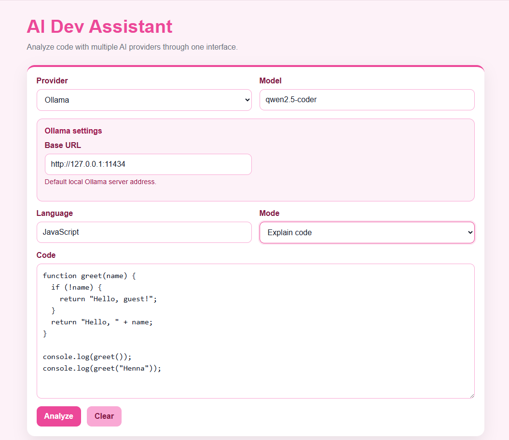
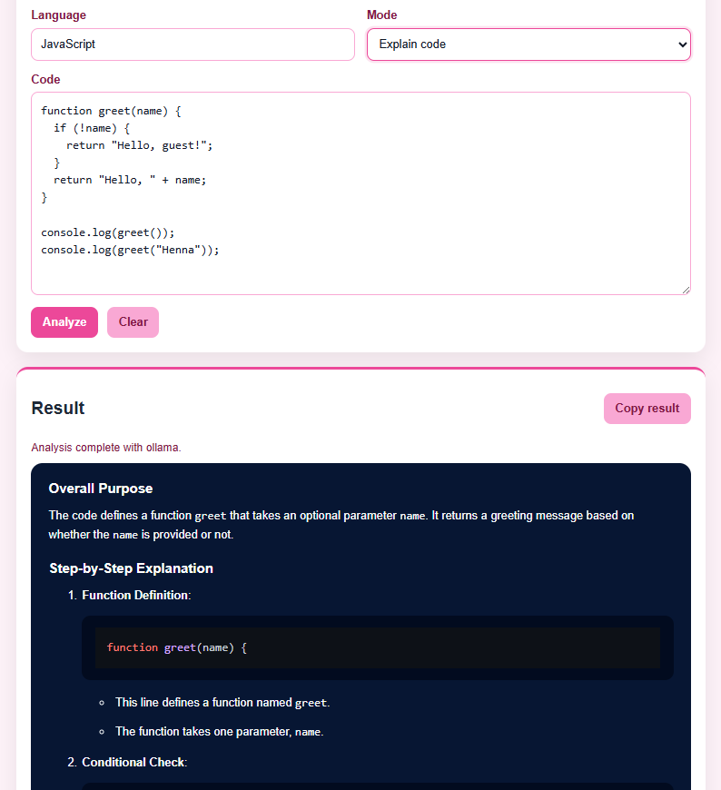
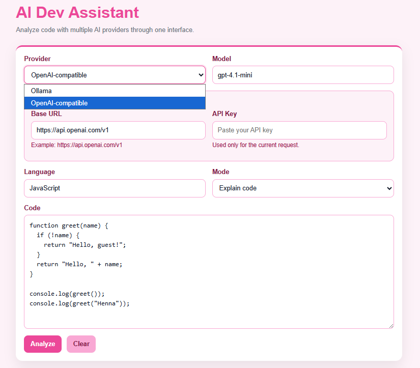
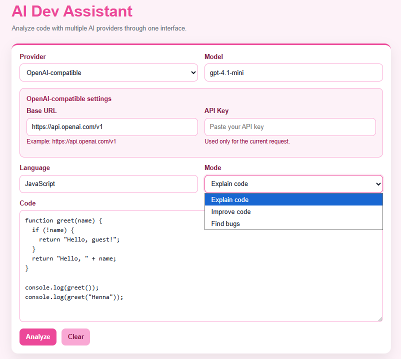

# AI Dev Assistant

A multi-provider AI tool for analyzing code through one interface.

Supports both local models (via Ollama) and OpenAI-compatible APIs, allowing flexible use of AI in development workflows.

---

## 🌐 Live demo

[View the live showcase](https://henvaa.github.io/AI-Dev-Assistant/)

## ✨ Features

- Explain code step-by-step
- Suggest improvements
- Detect potential bugs
- Works with multiple AI providers:
  - Ollama (local models)
  - OpenAI-compatible APIs
- Clean and simple UI

---

## 🧠 Why I built this

I wanted to explore how AI can be integrated into real development workflows — not just as a chat tool, but as part of an actual application.

This project focuses on:
- Practical AI usage in software development
- Multi-provider architecture
- Building a usable developer tool

---

## 🖼️ Screenshots

### Main view



### Generated explanation



### Provider-specific settings



### Different analysis modes



---

## 🧩 How it works

1. User inputs code
2. Selects:
   - provider
   - model
   - analysis mode
3. Backend builds a prompt
4. Sends request to selected AI provider
5. Response is rendered as formatted output

---

## 🏗️ Architecture

- Frontend: HTML, CSS, JavaScript
- Backend: Node.js + Express
- Providers:
  - Ollama (local)
  - OpenAI-compatible API

The provider layer abstracts differences between APIs, allowing the same UI to work with both local and cloud-based AI models.

---

## 📁 Project structure

- `/index.html` → project showcase (GitHub Pages live demo)
- `/public` → application frontend (served locally via Express)
- `/public/index.html` → main UI for the application
- `/src` → backend logic and AI provider integrations
- `/images` → screenshots used in README and showcase

---

## ⚙️ Getting started

### 1. Install dependencies

```bash
npm install
```

### 2. Start the server
```bash
npm run dev
```

### 3. Open in browser
```bash
http://localhost:3000
```
---

## 🧪 Example use cases

- Understand unfamiliar code
- Debug small issues
- Learn how code works
- Improve code quality

Example: Paste a JavaScript function and get a step-by-step explanation of how it works.

---

## 🔒 Privacy / Security

This application does not store or persist submitted code by default.

- When using **Ollama**, the code is processed locally on the user's machine through a local model.
- When using an **OpenAI-compatible provider**, the code is sent to the selected external API service for processing.

Users should avoid submitting sensitive, private, or proprietary code when using external providers.

This project is intended for development, learning, and non-sensitive code analysis use cases.

---

## 🎯 What I learned

- How to integrate AI APIs into applications
- Handling multiple providers with different interfaces
- Prompt design for developer-focused use cases
- Building a simple but usable UI
- Debugging real integration issues (API, local models, etc.)

---

## 📌 Possible future improvements

- Add more providers
- Save history of analyses
- Better UI/UX
- Syntax-aware highlighting improvements

---

### 👤 Author

Henna Väätäinen
